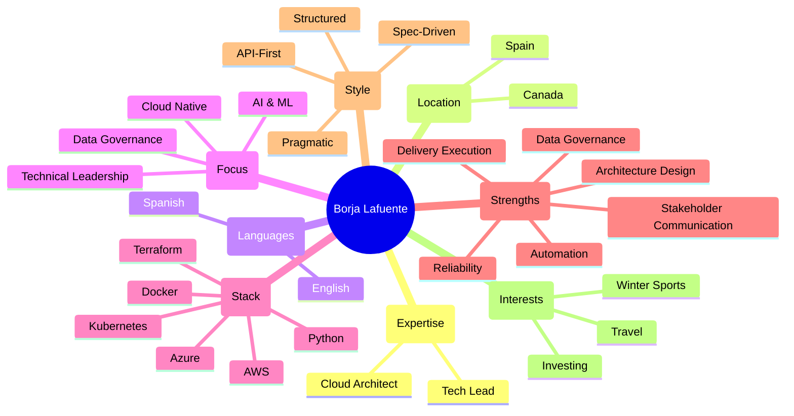

## Tech Lead · Cloud Solutions Architect

```mermaid
---
title: Who I Am
---
mindmap
  root (( Borja Lafuente ))
    (Expertise)
      Cloud Architect
      Tech Lead
    (Location)
      Spain
      Canada
    (Languages)
      Spanish
      English
    (Focus)
      Cloud Native
      Data Governance
      Technical Leadership
      AI & ML
    (Stack)
      AWS
      Azure
      Terraform
      Kubernetes
      Docker
      Python
    (Strengths)
      Architecture Design
      Delivery Execution
      Data Governance
      Automation
      Reliability
      Stakeholder Communication
    (Style)
      Spec-Driven
      API-First
      Pragmatic
      Structured
    (Interests)
      Investing
      Travel
      Winter Sports
```

### Technologies

### Workflow

```mermaid
flowchart LR
  A([Discover]) --> B([Simplify])
  B --> C([Align])
  C --> D([Automate])
  D --> E([Harden])
  E --> F([Document])
  F --> A

  style A fill:#0f172a,stroke:#38bdf8,color:#ffffff
  style B fill:#1d4ed8,stroke:#93c5fd,color:#ffffff
  style C fill:#0ea5e9,stroke:#bae6fd,color:#ffffff
  style D fill:#14b8a6,stroke:#99f6e4,color:#ffffff
  style E fill:#475569,stroke:#cbd5e1,color:#ffffff
  style F fill:#111827,stroke:#d1d5db,color:#ffffff
```

### Contact

  
  
  

